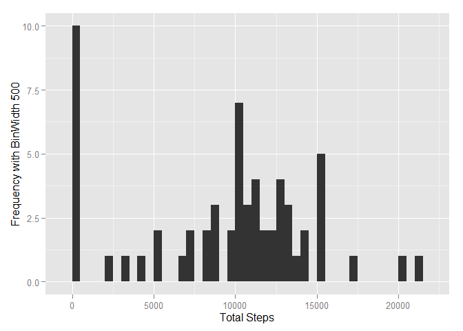
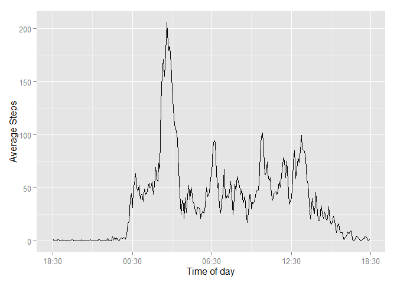
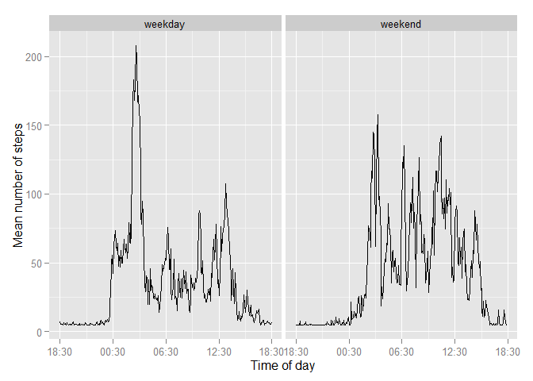

# Reproducible Research: Peer Assessment 1
opts_chunk$set(echo=TRUE, results='asis')

## Loading and preprocessing the data


```r
if(!file.exists('activity.csv')){
    unzip('activity.zip')
}
activity <- read.csv('activity.csv')

time <- formatC(activity$interval / 100, 2, format='f')
activity$date.time <- as.POSIXct(paste(activity$date, time),
                                 format='%Y-%m-%d %H.%M',tz='GMT')

activity$time <- format(activity$date.time, format='%H:%M:%S')
activity$time <- as.POSIXct(activity$time, format='%H:%M:%S')
```

## What is mean total number of steps taken per day?

### [i] Calculate total steps and find mean and median


```r
total.steps <- tapply(activity$steps, activity$date, sum, na.rm=TRUE)
mean(total.steps)
```

```
## [1] 9354.23
```

```r
median(total.steps)
```

```
## [1] 10395
```

### [ii] Draw a HISTOGRAM


```r
library(ggplot2)
qplot(total.steps, xlab='Total Steps', 
                   ylab='Frequency with BinWidth 500', binwidth=500)
```

 

## What is the average daily activity pattern?

### [i] Calculate mean steps for each interval and build a dataframe


```r
mean.steps <- tapply(activity$steps, activity$time, mean, na.rm=TRUE)
daily.pattern <- data.frame(time=as.POSIXct(names(mean.steps)),
                            mean.steps=mean.steps)
```

### [ii] Draw a TIME-SERIES


```r
library(scales)
ggplot(daily.pattern, aes(time, mean.steps)) + 
    geom_line() +
    xlab('Time of day') +
    ylab('Average Steps') +
    scale_x_datetime(labels=date_format(format='%H:%M'))
```

 

### [iii] Find interval with highest steps


```r
moststeps <- which.max(daily.pattern$mean.steps)
format(daily.pattern[moststeps,'time'], format='%H:%M')
```

```
## [1] "08:35"
```

## Imputing missing values

### [i] Using mean steps for imputing


```r
library(Hmisc)
```

```
## Warning: package 'Hmisc' was built under R version 3.2.2
```

```
## Loading required package: grid
## Loading required package: lattice
## Loading required package: survival
## Loading required package: Formula
```

```
## Warning: package 'Formula' was built under R version 3.2.2
```

```
## 
## Attaching package: 'Hmisc'
## 
## The following objects are masked from 'package:base':
## 
##     format.pval, round.POSIXt, trunc.POSIXt, units
```

```r
activity.imputed <- activity
activity.imputed$steps <- with(activity.imputed, impute(steps, mean))
```

### [ii] Compare Mean & Median of Imputed data with Original data


```r
total.steps.imputed <- tapply(activity.imputed$steps, 
                              activity.imputed$date, sum)
mean(total.steps)
```

```
## [1] 9354.23
```

```r
mean(total.steps.imputed)
```

```
## [1] 10766.19
```

```r
median(total.steps)
```

```
## [1] 10395
```

```r
median(total.steps.imputed)
```

```
## [1] 10766.19
```

### [iii] Draw a HISTOGRAM


```r
qplot(total.steps.imputed, xlab='Total steps', 
                           ylab='Frequency with BinWidth = 500', binwidth=500)
```

 

## Are there differences in activity patterns between weekdays and weekends?

### [i] Add a column to identify weekend / weekday


```r
day.type <- function(date) {
    if (weekdays(date) %in% c('Saturday', 'Sunday')) {
        return('weekend')
    } else {
        return('weekday')
    }
}

day.types <- sapply(activity.imputed$date.time, day.type)
activity.imputed$day.type <- as.factor(day.types)
```

### [ii] Dataframe to store mean steps for weekend / weekday


```r
mean.steps <- tapply(activity.imputed$steps, 
                     interaction(activity.imputed$time,
                                 activity.imputed$day.type),
                     mean, na.rm=TRUE)
day.type.pattern <- data.frame(time=as.POSIXct(names(mean.steps)),
                               mean.steps=mean.steps,
                               day.type=as.factor(c(rep('weekday', 288),
                                                   rep('weekend', 288))))
```

### [iii] Look at the plots for weekend / weekday


```r
ggplot(day.type.pattern, aes(time, mean.steps)) + 
    geom_line() +
    xlab('Time of day') +
    ylab('Mean number of steps') +
    scale_x_datetime(labels=date_format(format='%H:%M')) +
    facet_grid(. ~ day.type)
```

 
